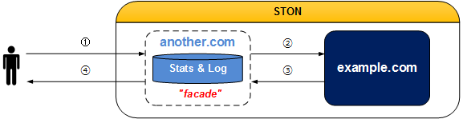

.. _adv-vhost:

14장. 가상호스트 고급기법
******************

이 장에서는 가상호스트를 활용하여 서비스를 유연하게 구성하는 여러 기법에 대해 설명한다.

가상호스트는 보통 원본(Domain 또는 IP목록)과 1:1로 구성되는 것이 기본이다.
하지만 상황에 따라 대표 가상호스트를 여러 하위 가상호스트로 분기하거나,
반대로 독립적인 여러 가상호스트를 하나의 서비스로 포장해야 하는 경우도 발생한다.
각 기능에 따라 :ref:`monitoring_stats_vhost_client` / :ref:`admin-log-access` 의 정책이 다를 수 있음을 유의해야 한다.

.. toctree::
   :maxdepth: 2

.. _adv-vhost-facadevhost:

Facade 가상호스트
====================================

``<Alias>`` 는 가상호스트의 별명만을 추가하는 것이므로 통계와 로그가 분리되지 않는다.
가상호스트는 공유하지만 도메인에 따라 :ref:`monitoring_stats_vhost_client` 와 :ref:`admin-log-access` 를 분리하고 싶은 경우 Facade가상호스트를 설정한다.

   facade는 통계와 로그만 수집한다.

::

    # vhosts.xml - <Vhosts>

    <Vhost Name="example.com">
       ...
    </Vhost>

    <Vhost Name="another.com" Status="facade:example.com">
       ...
    </Vhost>

``Status`` 속성의 값을 ``facade:`` + ``가상호스트`` 로 설정한다.
예제의 경우 :ref:`monitoring_stats_vhost_client` 와 :ref:`admin-log-access` 는 example.com이 아닌 클라이언트가 요청한 도메인인 another.com으로 수집된다.

.. _adv-vhost-sub-path:

Sub-Path 지정
====================================

한 가상호스트에서 경로에 따라 다른 가상호스트가 처리하도록 설정할 수 있다.

.. figure:: img/adv_vhost_subpath.png
   :align: center

   통계/로그는 요청을 최종처리한 각각의 가상호스트에 기록된다.

::

   # vhosts.xml - <Vhosts>

   <Vhost Name="sports.com">
     
       <Path Vhost="baseball.com">/baseball/<Path>
       <Path Vhost="football.com">/football/<Path>
       <Path Vhost="photo.com">/*.jpg<Path>
     
   </Vhost>

   <Vhost Name="baseball.com" />
   <Vhost Name="football.com" />
   <Vhost Name="photo.com" />

-  ```` 경로나 패턴이 일치하면 해당 요청을 다른 가상호스트로 보낸다.
   일치하지 않는 경우만 현재 가상호스트가 처리한다.

   - ``Status (기본: Active)`` Inactive인 경우 무시한다.

   -  ``<Path>`` 클라이언트가 요청한 URI와 경로가 일치하면 ``Vhost`` 로 해당 요청을 보낸다.
      값은 경로 또는 패턴만 가능하다. ::

         <Path Vhost="baseball.com">baseball<Path>
         <Path Vhost="photo.com">*.jpg<Path>

      위와 같이 입력해도 각각 /baseball/과 /*.jpg로 인식된다.

예를 들어 클라이언트가 다음과 같이 요청했다면 해당 요청은 가상호스트 football.com이 처리한다. ::

   GET /football/rank.html HTTP/1.1
   Host: sports.com

.. _adv-vhost-redirection-trace:

HTTP Redirect 추적
====================================

원본서버에서 Redirect계열(301, 302, 303, 307)로 응답하는 경우 Location헤더를 추적하여 콘텐츠를 요청한다.

   .. figure:: img/conf_redirectiontrace.png
      :align: center

      클라이언트는 Redirect여부를 모른다.

::

   # server.xml - <Server><VHostDefault><OriginOptions><Http>
   # vhosts.xml - <Vhosts><Vhost><OriginOptions><Http>

   <RedirectionTrace>OFF</RedirectionTrace>

-  ``<RedirectionTrace>``

   - ``OFF (기본)`` 3xx 응답으로 저장된다.

   - ``ON`` Location헤더에 명시된 주소에서 콘텐츠를 다운로드 한다.
     형식에 맞지 않거나 Location헤더가 없는 경우에는 동작하지 않는다.
     무한히 Redirect되는 경우를 방지하기 위하여 1회만 추적한다.

