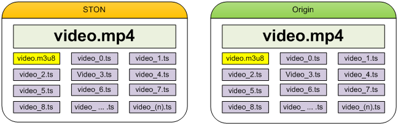

.. _client_session:

7장. 클라이언트 세션
******************

이 장에서는 프로토콜에 따른 클라이언트 세션과 세부적인 응답을 처리하는 방식에 대해 설명한다.
너무 많은 클라이언트 세션이 유지되도록 설정하면 자칫 시스템 부하가 높아질 수 있다.
따라서 프로토콜 특성에 맞는 설정을 정확히 이해할 수 있도록 하자.

.. toctree::
   :maxdepth: 2

.. _client_session_rtmp_session:

RTMP 세션
====================================

RTMP 클라이언트와 STON 미디어서버에 사이에 생성되는 RTMP 세션에 대해 설정한다. ::

   # server.xml - <Server><VHostDefault><Options>
   # vhosts.xml - <Vhosts><Vhost><Options>
   
   <Rtmp>
       <BufferSize>3</BufferSize>
       <ClientKeepAliveSec>10</ClientKeepAliveSec>
   </Rtmp>

-  ``<BufferSize> (기본: 3초)``
   PLAY가 시작되면 설정된 시간(초)만큼을 대역폭 제한없이 클라이언트에게 전송한다.

-  ``<ClientKeepAliveSec> (기본: 10초)``
   아무런 통신이 없는 상태로 설정된 시간이 경과하면 RTMP 클라이언트 세션에게 Ping Request을 보낸다.
   RTMP 클라이언트가 Ping Response를 보내면 세션은 유지되지만 응답하지 않을 경우 연결을 종료한다.

.. _client_session_http_session:

HTTP 세션
====================================

HTTP 클라이언트가 STON 미디어서버에 접속하면 HTTP세션이 생성된다.
HTTP 클라이언트는 HTTP 세션을 통해 서버에 저장된 여러 콘텐츠를 서비스 받는다.
요청부터 응답까지를 하나의 **HTTP 트랜잭션** 이라고 부른다. ::

   # server.xml - <Server><VHostDefault><Options>
   # vhosts.xml - <Vhosts><Vhost><Options>
   
   <Http>
       <ClientKeepAliveSec>10</ClientKeepAliveSec>
       <ConnectionHeader>keep-alive</ConnectionHeader>
       <KeepAliveHeader Max="0">ON</KeepAliveHeader>
   </Http>

-  ``<ClientKeepAliveSec> (기본: 10초)``
   아무런 통신이 없는 상태로 설정된 시간이 경과하면 연결을 종료한다.

-  ``<ConnectionHeader> (기본: keep-alive)``
   HTTP 클라이언트에게 보내는 응답의 Connection헤더( ``keep-alive`` 또는 ``close`` )를 설정한다.

-  ``<KeepAliveHeader>``

   - ``ON (기본)`` HTTP응답에 Keep-Alive헤더를 명시한다.
     ``Max (기본: 0)`` 를 0보다 크게 설정하면 Keep-Alive헤더의 값으로 ``Max`` 값이 명시된다.
    이후 HTTP 트랜잭션이 발생할때마다 1씩 차감된다.

   - ``OFF`` HTTP응답에 Keep-Alive헤더를 생략한다.

.. _client_session_http_session_lifecyle:

세션 유지정책
---------------------

STON 미디어서버의 HTTP 세션 유지정책은 Apache의 정책을 따른다.
HTTP 헤더 값에 따른 변수가 많아 다소 복잡하다.
HTTP 세션 유지정책에 영향을 주는 요소는 다음과 같다.

- HTTP 클라이언트 요청에 명시된 Connection헤더 ("Keep-Alive" 또는 "Close")
- 가상호스트 ``<Connection>`` 설정
- 가상호스트 세션 Keep-Alive시간 설정
- 가상호스트 ``<Keep-Alive>`` 설정

1. HTTP 클라이언트 요청에 "Connection: Close"로 명시되어 있는 경우 ::

      GET / HTTP/1.1
      ...(생략)...
      Connection: Close

   이같은 요청에 대해서는 가상호스트 설정여부와 상관없이
   "Connection: Close"로 응답한다. Keep-Alive헤더는 명시되지 않는다. ::

      HTTP/1.1 200 OK
      ...(생략)...
      Connection: Close

   이 HTTP 트랜잭션이 완료되면 HTTP 연결을 종료한다.

2. ``<ConnectionHeader>`` 가 ``Close`` 로 설정된 경우 ::

      # server.xml - <Server><VHostDefault><Options><Http>
      # vhosts.xml - <Vhosts><Vhost><Options><Http>

      <ConnectionHeader>Close</ConnectionHeader>

   HTTP 클라이언트 요청과 상관없이 "Connection: Close"로 응답한다.
   Keep-Alive헤더는 명시되지 않는다. ::

      HTTP/1.1 200 OK
      ...(생략)...
      Connection: Close

3. ``<KeepAliveHeader>`` 가 ``OFF`` 로 설정된 경우 ::

      # server.xml - <Server><VHostDefault><Options><Http>
      # vhosts.xml - <Vhosts><Vhost><Options><Http>

      <ConnectionHeader>Keep-Alive</ConnectionHeader>
      <KeepAliveHeader>OFF</KeepAliveHeader>

   Keep-Alive헤더가 명시되지 않는다. HTTP 세션은 지속적으로 재사용가능하다. ::

      HTTP/1.1 200 OK
      ...(생략)...
      Connection: Keep-Alive

4. ``<KeepAliveHeader>`` 가 ``ON`` 으로 설정된 경우 ::

      # server.xml - <Server><VHostDefault><Options><Http>
      # vhosts.xml - <Vhosts><Vhost><Options><Http>

      <HttpClientKeepAliveSec>10</HttpClientKeepAliveSec>
      <ConnectionHeader>Keep-Alive</ConnectionHeader>
      <KeepAliveHeader>ON</KeepAliveHeader>

   Keep-Alive헤더가 명시된다.
   timeout값은 세션 Keep-Alive시간 설정을 사용한다. ::

      HTTP/1.1 200 OK
      ...(생략)...
      Connection: Keep-Alive
      Keep-Alive: timeout=10

   .. note::

      < ``<Keep-Alive>`` 와 ``<HttpClientKeepAliveSec>`` 의 관계 >

      ``<Keep-Alive>`` 설정시 ``<HttpClientKeepAliveSec>`` 를 참고하지만 ``<HttpClientKeepAliveSec>`` 는 보다 근본적인 문제와 관련이 있다.
      성능이나 자원적으로 가장 중요한 이슈는 Idle세션(=HTTP 트랜잭션이 발생되지 않는 세션)의 정리시점을 잡는 것이다.
      HTTP 헤더 설정은 동적으로 변경되거나 때로 생략될 수 있지만 Idle세션 정리는 훨씬 민감한 문제이다.
      이런 이유 때문에 ``<HttpClientKeepAliveSec>`` 는 ``<KeepAliveHeader>`` 에 통합되지 않고 별도로 존재한다.

5. ``<KeepAliveHeader>`` 의 ``Max`` 속성이 설정된 경우 ::

      # server.xml - <Server><VHostDefault><Options><Http>
      # vhosts.xml - <Vhosts><Vhost><Options><Http>

      <HttpClientKeepAliveSec>10</HttpClientKeepAliveSec>
      <ConnectionHeader>Keep-Alive</ConnectionHeader>
      <KeepAliveHeader Max="50">ON</KeepAliveHeader>

   Keep-Alive헤더에 max값을 명시한다.
   이 세션은 max회만큼 사용이 가능하며 HTTP 트랜잭션이 진행될때마다 1씩 감소된다. ::

      HTTP/1.1 200 OK
      ...(생략)...
      Connection: Keep-Alive
      Keep-Alive: timeout=10, max=50

6. Keep-Alive의 max가 만료된 경우 ::

   위의 설정대로 max가 설정되었다면 max는 점차 줄어 다음처럼 1까지 도달하게 된다. ::

      HTTP/1.1 200 OK
      ...(생략)...
      Connection: Keep-Alive
      Keep-Alive: timeout=10, max=1

   이 응답은 현재 세션으로 앞으로 1번 HTTP 트랜잭션 진행이 가능하다는 의미이다.
   이 세션으로 HTTP 요청이 한번 더 진행될 경우 다음과 같이 "Connection: Close"로 응답한다. ::

      HTTP/1.1 200 OK
      ...(생략)...
      Connection: Close

.. _client_session_http_session_upfrontheader:

MP4 헤더위치 변경
---------------------

MP4(M4A 포함)의 경우 인코딩 과정 중에는 헤더를 완성할 수 없기 때문에 완료 후 파일의 맨 뒤에 붙인다.
헤더를 앞으로 옮기려면 별도의 작업이 필요하다.
헤더가 뒤에 있다면 이를 지원하지 않는 플레이어에서 Pseudo-Streaming이 불가능하다.
헤더위치 변경을 통해 HTTP Pseudo-Streaming을 간편하게 지원할 수 있다.

헤더위치 변경은 전송단계에서만 발생할 뿐 원본의 형태를 변경하지 않는다.
별도의 저장공간을 사용하지도 않는다. ::

   # server.xml - <Server><VHostDefault><Options><Http>
   # vhosts.xml - <Vhosts><Vhost><Options><Http>

   <UpfrontMP4Header>ON</UpfrontMP4Header>

-  ``<UpfrontMP4Header>``

   - ``ON (기본)`` 확장자가 .mp4 또는 .m4a이고 헤더가 뒤에 있다면 헤더를 앞으로 옮겨서 전송한다.

   - ``OFF`` 아무 것도 하지 않는다.

처음 요청되는 콘텐츠의 헤더를 앞으로 옮겨야 한다면 헤더를 옮기기위해 필요한 부분을 우선적으로 다운로드 받는다.
STON 미디어서버는 아주 영리할뿐만 아니라 빠르게 동작한다.
커튼 뒤의 복잡한 과정과는 상관없이, HTTP Pseudo-Streaming은 자연스럽게 이루어진다.

.. note::

   분석할 수 없거나 깨진 파일이라면 원본형태 그대로 서비스된다.

.. _client_session_http_session_bt:

Bandwidth Throttling
--------------------------

BT(Bandwidth Throttling)이란 (각 세션마다)클라이언트 전송 대역폭을 동적으로 조절하는 기능이다.
일반적인 미디어 파일의 내부는 다음과 같이 헤더, V(Video), A(Audio)로 구성되어 있다.

.. figure:: img/conf_media_av.png
   :align: center

   헤더는 BT의 대상이 아니다.

헤더는 재생시간이 길거나 Key Frame주기가 짧을수록 커진다.
그러므로 인식할 수 있는 미디어 파일이라면 원활한 재생을 위해 헤더는 대역폭 제한없이 전송한다.
다음 그림처럼 헤더가 완전히 전송된 뒤 BT가 시작된다.

.. figure:: img/conf_bandwidththrottling2.png
   :align: center

   동작 시나리오

::

   # server.xml - <Server><VHostDefault><Options><Http>
   # vhosts.xml - <Vhosts><Vhost><Options><Http>

   <BandwidthThrottling>
      <Settings>
         <Bandwidth Unit="kbps">1000</Bandwidth>
         <Ratio>100</Ratio>
         <Boost>5</Boost>
      </Settings>
      <Throttling>OFF</Throttling>
   </BandwidthThrottling>

``<BandwidthThrottling>`` 태그 하위에 기본동작을 설정한다.

-  ``<Settings>``

   기본 동작을 설정한다.

   -  ``<Bandwidth> (기본: 1000 Kbps)``
      클라이언트 전송 대역폭을 설정한다.
      ``Unit`` 속성을 통해 기본 단위( ``kbps`` , ``mbps`` , ``bytes`` , ``kb`` , ``mb`` )를 설정한다.

   -  ``<Ratio> (기본: 100 %)``
      ``<Bandwidth>`` 설정에 비율을 반영하여 대역폭을 설정한다.

   -  ``<Boost> (기본: 5 초)``
      일정 시간만큼의 데이터를 속도제한 없이 클라이언트에게 전송한다.
      데이터의 양은 ``<Boost>`` X ``<Bandwidth>`` X ``<Ratio>`` 공식으로 계산한다.

-  ``<Throttling>``

   -  ``OFF (기본)`` BT를 적용하지 않는다.
   -  ``ON`` 조건목록과 일치하면 BT를 적용한다.

BT는 조건목록을 설정해야 동작한다.
설정된 순서대로 조건과 일치하는지 검사한다.
전송 정책은 /svc/{가상호스트 이름}/http_throttling.txt 에 설정한다. ::

   # /svc/www.example.com/http_throttling.txt
   # 구분자는 콤마(,)이며 {조건},{Bandwidth},{Ratio},{Boost} 순서로 표기한다.
   # {조건}을 제외한 모든 필드는  생략가능하다.
   # 생략된 필드는 ``<Settings>`` 에 설정된 기본 값을 사용한다.
   # 모든 조건표현은 acl.txt설정과 동일하다.
   # {Bandwidth} 단위는 ``<Settings>`` ``<Bandwidth>`` 의 ``Unit`` 속성을 사용한다.

   # 3초의 데이터를 속도 제한없이 전송한 후 3Mbps(3000Kbps = 2000Kbps X 150%)로 클라이언트에게 전송한다.
   $IP[192.168.1.1], 2000, 150, 3

   # bandwidth만 정의. 5(기본)초의 데이터를 속도 제한없이 전송한 후 800 Kbps로 클라이언트에게 전송한다.
   !HEADER[referer], 800

   # boost만 정의. 10초의 데이터를 속도 제한없이 전송한 후 1000 Kbps로 클라이언트에게 전송한다.
   HEADER[cookie], , , 10

   # 확장자가 m4a인 경우 BT를 적용하지 않는다.
   $URL[*.m4a], no

미디어 파일(MP4, M4A, MP3)을 분석하면 Encoding Rate로부터 Bandwidth를 얻을 수 있다.
접근되는 콘텐츠의 확장자는 반드시 .mp4, .m4a, .mp3 중 하나여야 한다.
동적으로 Bandwidth를 추출하려면 다음과 같이 Bandwidth뒤에 **x** 를 붙인다. ::

   # /vod/*.mp4 파일에 대한 접근이라면 bandwidth를 구한다. 구할 수 없다면 1000을 bandwidth로 사용한다.
   $URL[/vod/*.mp4], 1000x, 120, 5

   # user-agent헤더가 없다면 bandwidth를 구한다. 구할 수 없다면 500을 bandwidth로 사용한다.
   !HEADER[user-agent], 500x

   # /low_quality/* 파일에 대한 접근이라면 bandwidth를 구한다. 구할 수 없다면 기본 값을 bandwidth로 사용한다.
   $URL[/low_quality/*], x, 200

약속된 QueryString을 사용하여 ``<Bandwidth>`` , ``<Ratio>`` , ``<Boost>`` 를 URL로부터 입력받을 수 있다.
QueryString은 앞서 살펴본 설정보다 우선한다. ::

   # server.xml - <Server><VHostDefault><Options><Http>
   # vhosts.xml - <Vhosts><Vhost><Options><Http>

   <BandwidthThrottling>
      <Settings>
         <Bandwidth Param="mybandwidth" Unit="mbps">2</Bandwidth>
         <Ratio Param="myratio">100</Ratio>
         <Boost Param="myboost">3</Boost>
      </Settings>
      <Throttling QueryString="ON">ON</Throttling>
   </BandwidthThrottling>

-  ``<Bandwidth>`` , ``<Ratio>`` , ``<Boost>`` 의 ``Param``

    각각의 의미에 맞게 QueryString 키를 설정한다.

-  ``<Throttling>`` 의 ``QueryString``

   - ``OFF (기본)`` QueryString으로 조건을 재정의하지 않는다.

   - ``ON`` QueryString으로 조건을 재정의한다.

위와 같이 설정되어 있다면 다음과 같이 클라이언트가 요청한 URL에 따라 BT가 동적으로 설정된다. ::

    # 10초의 데이터를 속도 제한없이 전송한 후 1.3Mbps(1mbps X 130%)로 클라이언트에게 전송한다.
    http://www.example.com/video/sample.wmv?myboost=10&mybandwidth=1&myratio=130

반드시 모든 파라미터를 명시할 필요는 없다. ::

    http://www.example.com/video/sample.wmv?myratio=150

위와 같이 일부 조건이 생략된 경우 나머지 조건(여기서는 bandwidth, boost)을 결정하기 위해 조건목록을 검색한다.
여기서도 적합한 조건을 찾지 못하는 경우 ``<Settings>`` 에 설정된 기본 값을 사용한다.
QueryString이 일부 존재하더라도 조건목록에서 미적용옵션(no)이 설정되어 있다면
BT는 적용되지 않는다.

QueryString을 사용하므로 자칫 :ref:`caching-policy-applyquerystring` 과 혼동을 일으킬 소지가 있다.
:ref:`caching-policy-applyquerystring` 이 ``ON`` 인 경우 클라이언트가 요청한 URL의 QueryString이
모두 인식되지만 ``BoostParam`` , ``BandwidthParam`` , ``RatioParam`` 은 제외된다. ::

   GET /video.mp4?mybandwidth=2000&myratio=130&myboost=10
   GET /video.mp4?tag=3277&myboost=10&date=20130726

예를 들어 위같은 입력은 BT를 결정하는데 쓰일 뿐 Caching-Key를 생성하거나 원본서버로 요청을 보낼 때는 제거된다.
즉 각각 다음과 같이 인식된다. ::

    GET /video.mp4
    GET /video.mp4?tag=3277&date=20130726

.. _client_session_http_session_headermodify:

요청/응답 헤더변경
---------------------

HTTP 클라이언트 요청과 응답을 특정 조건에 따라 변경한다. ::

   # server.xml - <Server><VHostDefault><Options><Http>
   # vhosts.xml - <Vhosts><Vhost><Options><Http>

   <ModifyHeader FirstOnly="OFF">OFF</ModifyHeader>

-  ``<ModifyHeader>``

   -  ``OFF (기본)`` 변경하지 않는다.

   -  ``ON`` 헤더 변경조건에 따라 헤더를 변경한다.

헤더 변경시점을 정확히 이해하자.

-  **HTTP 요청헤더 변경시점**

   HTTP 요청을 최초로 인식하는 시점에 헤더를 변경한다.
   헤더가 변경되었다면 변경된 상태로 Cache 모듈에서 처리된다.
   단, Host헤더와 URI는 변경할 수 없다.

-  **HTTP 응답헤더 변경시점**

   HTTP 응답 직전에 헤더를 변경한다.
   단, Content-Length는 변경할 수 없다.

헤더 변경조건은 /svc/{가상호스트 이름}/http_headers.txt에 설정한다.
헤더는 멀티로 설정이 가능하므로 조건과 일치한다면 모든 변경설정이 순차적으로 모두 적용된다.

최초 조건에만 변경을 원할 경우 ``FirstOnly`` 속성을 ``ON`` 으로 설정한다.
서로 다른 조건이 같은 헤더를 변경하는 경우 ``set`` 에 의해 Last-Win이 되거나 명시적으로 ``put`` ``append`` 할 수 있다. ::

   # /svc/www.example.com/http_headers.txt
   # 구분자는 콤마(,)이다.

   # 요청변경
   # {Match}, {$REQ}, {Action(set|put|append|unset)} 순서로 표기한다.
   $IP[192.168.1.1], $REQ[SOAPAction], unset
   $IP[192.168.2.1-255], $REQ[accept-encoding: gzip], set
   $IP[192.168.3.0/24], $REQ[cache-control: no-cache], append
   $IP[192.168.4.0/255.255.255.0], $REQ[x-custom-header], unset
   $IP[AP], $REQ[X-Forwarded-For], unset
   $HEADER[user-agent: *IE6*], $REQ[accept-encoding], unset
   $HEADER[via], $REQ[via], unset
   $URL[/source/*.zip], $REQ[accept-encoding: deflate], set

   # 응답변경
   # {Match}, {$RES}, {Action(set|put|append|unset)}, {condition} 순서로 표기한다.
   # {condition}은 특정 응답코드에 한하여 헤더를 변경할 수 있지만 필수는 아니다.
   $IP[192.168.1.1], $RES[via: STON for CDN], set
   $IP[192.168.2.1-255], $RES[X-Cache], unset, 200
   $IP[192.168.3.0/24], $RES[cache-control: no-cache, private], append, 3xx
   $IP[192.168.4.0/255.255.255.0], $RES[x-custom-header], unset
   $HEADER[user-agent: *IE6*], $RES[vary], unset
   $HEADER[x-custom-header], $RES[cache-control: no-cache, private], append, 5xx
   $URL[/source/*], $RES[cache-control: no-cache], set, 404
   /secure/*.dat, $RES[x-custom], unset, 200
   /*.mp4, $RES[Access-Control-Allow-Origin: example1.com], set
   /*.mp4, $RES[Access-Control-Allow-Origin: example2.com], put

{Match}는 IP, GeoIP, Header, URL 4가지로 설정이 가능하다.

-  **IP**
   $IP[...]로 표기하며 IP, IP Range, Bitmask, Subnet 네 가지 형식을 지원한다.

-  **GeoIP**
   $IP[...]로 표기하며 반드시 :ref:`access-control-geoip` 가 설정되어 있어야 한다.
   국가코드는 `ISO 3166-1 alpha-2 <http://en.wikipedia.org/wiki/ISO_3166-1_alpha-2>`_ 와 `ISO 3166-1 alpha-3 <http://en.wikipedia.org/wiki/ISO_3166-1_alpha-3>`_ 를 지원한다.

-  **Header**
   $HEADER[Key : Value]로 표기한다.
   Value는 명확한 표현과 패턴을 지원한다.
   Value가 생략된 경우에는 Key에 해당하는 헤더의 존재유무를 조건으로 판단한다.

-  **URL**
   $URL[...]로 표기하며 생략이 가능하다. 명확한 표현과 패턴을 인식한다.

{$REQ}와 {$RES}는 헤더변경 방법을 설정한다.
``set`` ``put`` ``append`` 의 경우 {Key: Value}로 설정하며,
Value가 입력되지 않은 경우 빈 값("")이 입력된다.
``unset`` 의 경우 {Key}만 입력한다.

{Action}은 ``set`` , ``put`` , ``append`` , ``unset``  4가지로 설정이 가능하다.

-  ``set``  요청/응답 헤더에 설정되어 있는 Key와 Value를 헤더에 추가한다.
   이미 같은 Key가 존재한다면 이전 값을 덮어쓴다.

-  ``put``  ( ``set`` 과 유사하나) 같은 Key가 존재하면, 덮어쓰지 않고 새로운 라인으로 붙여 넣는다.

-  ``append`` ( ``set`` 과 유사하나) 같은 Key가 존재하면, 기존의 Value와 설정된 Value사이에 Comma(,)로 구분하여 값을 결합한다.

-  ``unset`` 요청/응답 헤더에 설정되어 있는 Key에 해당하는 헤더를 삭제한다.

{Condition}은 200이나 304같은 구체적인 응답 코드외에 2xx, 3xx, 4xx, 5xx처럼 응답코드 계열조건으로 설정한다.
{Match}와 일치하더라도 {Condition}과 일치하지 않는다면 변경이 반영되지 않는다.
{Condition}이 생략된 경우 응답코드를 검사하지 않는다.

.. _client_session_http_session_acceptencoding:

Accept-Encoding 헤더
---------------------

같은 URL에 대한 HTTP요청이라도 Accept-Encoding헤더의 존재 유무에 따라 다른 콘텐츠가 캐싱될 수 있다.
원본서버에 요청을 보내는 시점에 압축여부를 알 수 없다.
응답을 받았다고해도 압축여부를 매번 비교할 수도 없다.

   .. figure:: img/acceptencoding.png
      :align: center

      원본서버가 어떤 응답을 줄지 알 수 없다.

::

    # server.xml - <Server><VHostDefault><Options><Http>
    # vhosts.xml - <Vhosts><Vhost><Options><Http>

    <AcceptEncoding>ON</AcceptEncoding>

-  ``<AcceptEncoding>``

   -  ``ON (기본)`` HTTP 클라이언트가 보내는 Accept-Encoding 헤더를 인식한다.

   -  ``OFF`` HTTP 클라이언트가 보내는 Accept-Encoding 헤더를 무시한다.

원본서버에서 압축을 지원하지 않거나, 압축이 필요없는 대용량 파일의 경우 ``OFF`` 로 설정하는 것이 바람직하다.

.. _client_session_http_session_originalheader:

원본 비표준 헤더
---------------------

성능과 보안상의 이유로 원본서버가 보내는 헤더 중 표준헤더만을 선택적으로 인식한다. ::

   # server.xml - <Server><VHostDefault><Options><Http>
   # vhosts.xml - <Vhosts><Vhost><Options><Http>

   <OriginalHeader>OFF</OriginalHeader>

-  ``<OriginalHeader>``

   -  ``OFF (기본)`` 표준헤더가 아니라면 무시한다.

   -  ``ON`` cookie, set-cookie, set-cookie2를 제외한 모든 헤더를 저장하여 클라이언트에게 전달한다.
      단, 메모리와 저장비용을 좀 더 소비한다.

.. _client_session_hls_session:

HLS 세션
====================================

MP4/MP3파일을 HLS(HTTP Live Streaming)로 서비스한다.
원본서버는 더 이상 HLS서비스를 위해 파일을 분할저장할 필요가 없다.
헤더의 위치에 상관없이 다운로드와 동시에 실시간으로 .m3u8/.ts파일 변환 후 서비스한다.

..  note::

    STON 미디어서버가 지원하는 HLS는 Elementary Stream(Video 또는 Audio)을 변환하는 트랜스코딩(Transcoding)이 아니다.
    그러므로 HLS에 적합한 형식으로 인코딩된 파일에 한해서 원활한 단말 재생이 가능하다.
    인코딩이 적합하지 않을 경우 화면이나 깨지거나 소리가 재생되지 않을 수 있다.
    Apple에서 밝히고 있는 Video/Audio 인코딩 규격은 다음과 같다.

    What are the specifics of the video and audio formats supported?
    Although the protocol specification does not limit the video and audio formats, the current Apple implementation supports the following formats:

    [Video]
    H.264 Baseline Level 3.0, Baseline Level 3.1, Main Level 3.1, and High Profile Level 4.1.

    [Audio]
    HE-AAC or AAC-LC up to 48 kHz, stereo audio
    MP3 (MPEG-1 Audio Layer 3) 8 kHz to 48 kHz, stereo audio
    AC-3 (for Apple TV, in pass-through mode only)

    Note: iPad, iPhone 3G, and iPod touch (2nd generation and later) support H.264 Baseline 3.1. If your app runs on older versions of iPhone or iPod touch, however, you should use H.264 Baseline 3.0 for compatibility. If your content is intended solely for iPad, Apple TV, iPhone 4 and later, and Mac OS X computers, you should use Main Level 3.1.

기존 방식의 경우 Pseudo-Streaming과 HLS를 위해 다음과 같이 원본파일이 각각 존재해야 한다.
이런 경우 STON 역시 원본 파일을 그대로 복제하여 고객에게 서비스한다.
하지만 재생시간이 길수록 파생파일은 많아지며 관리의 어려움은 증가한다.

   수고가 많은 HLS

STON 미디어서버는 원본파일로부터 HLS서비스에 필요한 파일을 동적으로 생성한다.

.. figure:: img/conf_media_mp4hls2.png
   :align: center

   똑똑한 HLS

모든 .m3u8/.ts파일은 원본파일에서 파생되며 별도의 저장공간을 소비하지 않는다.
서비스 즉시 메모리에 임시적으로 생성되며 서비스되지 않을 때 자동으로 없어진다. 

.. _client_session_hls_session_mp4:

MP4
---------------------
MP4파일을 HLS(HTTP Live Streaming)로 서비스한다. ::

   # server.xml - <Server><VHostDefault><Options>
   # vhosts.xml - <Vhosts><Vhost><Options>
   
   <Hls>
       <ClientKeepAliveSec>10</ClientKeepAliveSec>
       <MP4 Status="Active">
          <Index Ver="3" Alternates="ON">index.m3u8</Index>
          <Sequence>0</Sequence>
          <Duration>10</Duration>
          <AlternatesName>playlist.m3u8</AlternatesName>
       </MP4>
   </Hls>

-  ``<ClientKeepAliveSec> (기본: 10초)``
   아무런 통신이 없는 상태로 설정된 시간이 경과하면 연결을 종료한다.

-  ``<MP4>``

   - ``Status (기본: Active)`` 값이 ``Inactive`` 라면 비활성화된다.

-  ``<Index> (기본: index.m3u8)`` HLS 인덱스(.m3u8) 파일명

   - ``Ver (기본 3)`` 인덱스 파일 버전.
     3인 경우 ``#EXT-X-VERSION:3`` 헤더가 명시되며 ``#EXTINF`` 의 시간 값이 소수점 3째 자리까지 표시된다.
     1인 경우 ``#EXT-X-VERSION`` 헤더가 없으며, ``#EXTINF`` 의 시간 값이 정수(반올림)로 표시된다.

   - ``Alternates (기본: ON)`` Stream Alternates 사용여부.

     .. figure:: img/hls_alternates_on.png
        :align: center

        ON. ``<AlternatesName>`` 에서 TS목록을 서비스한다.

     .. figure:: img/hls_alternates_off.png
        :align: center

        OFF. ``<Index>`` 에서 TS목록을 서비스한다.

-  ``<Sequence> (기본: 0)`` .ts 파일의 시작 번호. 이 수를 기준으로 순차적으로 증가한다.

-  ``<Duration> (기본: 10초)`` MP4를 HLS로 분할하는 기준 시간(초).
   분할의 기준은 Video/Audio의 KeyFrame이다.
   KeyFrame은 들쭉날쭉할 수 있으므로 정확히 분할되지 않는다.
   만약 10초로 분할하려는데 KeyFrame이 9초와 12초에 있다면 가까운 값(9초)을 선택한다.

-  ``<AlternatesName> (기본: playlist.m3u8)`` Stream Alternates 파일명. ::

      http://www.example.com/mp4:video.mp4/playlist.m3u8

서비스 주소가 다음과 같다면 해당 주소로 Pseudo-Streaming을 진행할 수 있다. ::

    http://www.example.com/video.mp4

다음 URL이 호출되면 /video.mp4로부터 index.m3u8파일을 생성한다. ::

   http://www.example.com/mp4:video.mp4/index.m3u8

``Alternates`` 속성이 ON이라면 ``<Index>`` 파일은 ``<AlternatesName>`` 파일을 서비스한다. ::

   #EXTM3U
   #EXT-X-VERSION:3
   #EXT-X-STREAM-INF:PROGRAM-ID=1,BANDWIDTH=200000,RESOLUTION=720x480
   /video.mp4/mp4hls/playlist.m3u8

``#EXT-X-STREAM-INF`` 의 Bandwidth와 Resolution은 영상을 분석하여 동적으로 제공한다.

.. note::

   Stream Alternates를 제공하긴 하지만 현재 버전에서 index.m3u8는 항상 하나의 서브 인덱스 파일(playlist.m3u8)만을 제공한다.
   캐시 입장에서는 video_1080.mp4와 video_720.mp4가 (인코딩 옵션만 다른) 같은 영상인지 알 수 없기 때문이다.

최종적으로 생성된 .ts 목록(버전 3)은 다음과 같다. ::

   #EXTM3U
   #EXT-X-TARGETDURATION:10
   #EXT-X-VERSION:3
   #EXT-X-MEDIA-SEQUENCE:0
   #EXTINF:11.637,
   /video.mp4/mp4hls/0.ts
   #EXTINF:10.092,
   /video.mp4/mp4hls/1.ts
   #EXTINF:10.112,
   /video.mp4/mp4hls/2.ts

   ... (중략)...

   #EXTINF:10.847,
   /video.mp4/mp4hls/161.ts
   #EXTINF:9.078,
   /video.mp4/mp4hls/162.ts
   #EXT-X-ENDLIST

.. _client_session_hls_session_mp3:

MP3
---------------------

MP3파일을 HLS(HTTP Live Streaming)로 서비스한다. ::

   # server.xml - <Server><VHostDefault><Options><Hls>
   # vhosts.xml - <Vhosts><Vhost><Options><Hls>

   <MP3 Status="Active">
       <Index Ver="3" Alternates="ON">index.m3u8</Index>
       <Sequence>0</Sequence>
       <Duration>10</Duration>
       <AlternatesName>playlist.m3u8</AlternatesName>
   </MP3>

모든 설정과 동작방식이 ``<MP4>`` 와 동일하다.

.. _client_session_hls_session_segmentation:

분할정책
---------------------

분할(Segmentation)에는 3가지 정책이 있다.

-  **KeyFrame 간격보다** ``<Duration>`` **설정이 큰 경우**
   KeyFrame이 3초, ``<Duration>`` 이 20초라면 20초를 넘지 않는 KeyFrame의 배수인 18초로 분할된다.

-  **KeyFrame 간격과** ``<Duration>`` **이 비슷한 경우**
   KeyFrame이 9초, ``<Duration>`` 이 10초라면 10초를 넘지 않는 KeyFrame의 배수인 9초로 분할된다.

-  **KeyFrame 간격이** ``<Duration>`` **설정보다 큰 경우**
   KeyFrame단위로 분할된다.

다음 클라이언트 요청에 대해 STON이 어떻게 동작하는지 이해해보자. ::

   GET /video.mp4/mp4hls/99.ts HTTP/1.1
   Range: bytes=0-512000
   Host: www.winesoft.co.kr

1.	``STON`` 최초 로딩 (아무 것도 캐싱되어 있지 않음.)
#.	``Client`` HTTP Range 요청 (100번째 파일의 최초 500KB 요청)
#.	``STON`` /video.mp4 파일 캐싱객체 생성
#.	``STON`` /video.mp4 파일 분석을 위해 필요한 부분만을 원본서버에서 다운로드
#.	``STON`` 100번째(99.ts)파일 서비스를 위해 필요한 부분만을 원본서버에서 다운로드
#.	``STON`` 100번째(99.ts)파일 생성 후 Range 서비스
#.	``STON`` 서비스가 완료되면 99.ts파일 파괴

.. note::

   ``MP4Trimming`` 기능이 ``ON`` 이라면 Trimming된 MP4를 HLS로 변환할 수 있다. (HLS영상을 Trimming할 수 없다. HLS는 MP4가 아니라 MPEG2TS 임에 주의하자.)
   영상을 Trimming한 뒤, HLS로 변환하기 때문에 다음과 같이 표현하는 것이 자연스럽다. ::

      /video.mp4?start=0&end=60/mp4hls/index.m3u8

   동작에는 문제가 없지만 QueryString을 맨 뒤에 붙이는 HTTP 규격에 어긋난다.
   이를 보완하기 위해 다음과 같은 표현해도 동작은 동일하다. ::

      /video.mp4/mp4hls/index.m3u8?start=0&end=60
      /video.mp4?start=0/mp4hls/index.m3u8?end=60