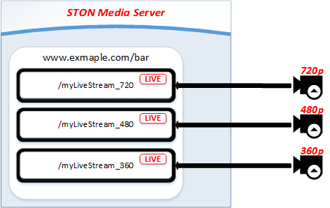

.. _multi-protocol-live:

[v1.x] 5장. LIVE
******************

이 장에서는 STON 미디어 서버의 LIVE 서비스 구성에 대해 설명한다.
STON 미디어 서버는 원본 LIVE 스트림으로부터 Push받거나, 게시된 원본 LIVE 스트림을 Pull방식으로 수신할 수 있다. 
두 방식을 혼용하면 쉽게 확장이 가능한 LIVE 서비스를 구성할 수 있다.

.. figure:: img/sms_live_workflow.png
   :align: center

가상호스트의 ``Type`` 속성이 반드시 Live로 설정되어 있어야 한다. ::

    # vhosts.xml

    <Vhosts>
        <Vhost Name="www.example.com/bar" Type="LIVE">
            ...
        </Vhost>
    </Vhosts>

.. note::

   STON 미디어 서버는 소스를 트랜스코딩(Transcoding)하지 않는다. 

프로토콜별 URL 표현은 :ref:`multi-protocol-url` 을 참고한다. 
서로 다른 프로토콜 변환이 발생할 때(RTMP to HLS/HLS to RTMP) 기술적인 제약사항이 있을 수 있다.

.. warning::

   VOD와 LIVE는 동적으로 변경할 수 없다. 
   같은 이름의 가상호스트를 사용하려면 삭제 후 다시 추가해주어야 한다.

.. toctree::
   :maxdepth: 2

.. _multi-protocol-live-channel:

채널(Channel)
====================================

채널(Channel)은 1개의 LIVE 서비스를 의미한다.
채널은 첫번째 참가자(Participant)에 의해 생성되고, 마지막 참가자와의 연결이 종로되면 자동으로 파괴된다. 
참가자(Participant)는 LIVE를 시청하는 클라이언트 또는 LIVE 인코더(Encoder)를 의미한다.

.. figure:: img/sms_live_channel_lifycycle.png
   :align: center

   채널의 생애(Life Cycle)

하나의 가상호스트는 여러 채널을 동시에 서비스할 수 있다.

.. figure:: img/sms_live_channel_multi.png
   :align: center

   1가상호스트 - 멀티 채널

단, 가상호스트에 속한 모든 채널의 원본 프로토콜(RTMP 또는 HLS)은 동일해야 한다.

.. note::

   채널은 LIVE의 특성상 메모리만을 이용해 동작하기 때문에 메모리 크기따라 생성할 수 있는 수가 제한된다. 
   예를 들어 사용가능한 메모리 크기가 10GB이고 채널 하나당 10MB를 소비한다면 약 1000개의 채널이 서비스 가능하다.
   메모리 한계를 초과할 경우 채널이 생성되지 않는다.

.. _multi-protocol-live-channel-create:

생성
------------------------------------

원본 LIVE스트림과 통신할 프로토콜을 지정해주어야 한다. ::

    # vhosts.xml

    <Vhosts>
        <Vhost Name="www.example.com/bar" Type="LIVE">
            <Origin Protocol="RTMP">
               ...
            </Origin>
        </Vhost>
    </Vhosts>

-  ``<Origin>``

   - ``Protocol (기본: RTMP)`` LIVE를 위해 원본서버와 통신할 프로토콜(RTMP 또는 HLS)을 설정한다.
     채널이 생성되면 ``Protocol`` 을 변경해도 반영되지 않는다.

클라이언트 요청 프로토콜과 상관없이 ``<Origin Protocol="...">`` 설정으로 원본서버와 통신한다.
채널이 생성되는 경우는 2가지 경우이다.

- 인코더로부터 LIVE 스트림이 RTMP로 Push되는 경우
- 클라이언트가 LIVE 스트림을 요청(Pull)하는 경우 (RTMP 또는 HLS)

.. _multi-protocol-live-channel-scaleout:

확장
------------------------------------

채널을 손쉽게 확장하기 위해서는 STON 미디어 서버를 2계층으로 구성할 것을 권장한다.

.. figure:: img/sms_live_channel_scaleout.png
   :align: center

   대규모 채널구성

Relay 레이어는 LIVE 소스(주로 인코더)로부터 LIVE 스트림을 Push받는다.
Edge 레이어는 클라이언트 요청에 의해(=On demand) LIVE 스트림을 Relay 레이어로부터 Pull한다.

더 많은 사용자를 위해서는 다음과 같이 3계층도 가능하다.

   좀 더 대규모 채널구성

.. _multi-protocol-live-channel-destroy:

파괴
------------------------------------

더 이상 채널에 연결된 참가자가 없을 경우 ``<ClientKeepAliveSec>`` 시간(초)만큼 채널을 유지한 뒤 파괴된다. ::

   # server.xml - <Server><VHostDefault><OriginOptions>
   # vhosts.xml - <Vhosts><Vhost><OriginOptions>
   
   <Rtmp>
      <ClientKeepAliveSec>60</ClientKeepAliveSec>
   </Rtmp>

   <Hls>
      <ClientKeepAliveSec>60</ClientKeepAliveSec>
   </Hls>

-  ``<ClientKeepAliveSec> (기본: 60초)``
   마지막 클라이언트의 연결이 종료된 후 설정된 시간(초)만큼 경과 후 채널을 파괴한다.

(HLS처럼) 클라이언트가 항상 채널에 연결되어 있는 것은 아니다.
채널을 즉시 파괴하면 자칫 너무 많은 생성/파괴가 발생할 수 있으며 이는 서비스 품질에 영향을 준다.
따라서 서비스 특성에 맞추어 일정시간 채널을 유지하도록하여 서비스 품질을 보장한다.

.. _multi-protocol-live-adobe-rtmp:

Adobe RTMP
====================================

Adobe RTMP를 이용해 인코더로부터 LIVE 스트림을 Push받거나, 게시된 LIVE 스트림을 RTMP로 Pull한다.

.. figure:: img/sms_live_workflow_rtmp.png
   :align: center

Push/Pull 사이에 혼동을 방지하기 위해 세부 주제 앞에 동작방식을 명시한다.

.. _multi-protocol-live-adobe-rtmp-push-basic:

[Push] 기본동작
------------------------------------

LIVE 스트림을 인코더로부터 직접 Push받을 수 있다.
가상호스트가 이미 생성되었다면 별도의 설정없이 여러 스트림을 동시에 Push받을 수 있다.

   Push하면 채널이 생성된다.

Push하는 대상을 제한하고 싶다면 "서버접근제어" 나 "가상호스트 접근제어"를 사용한다. 

- http://ston.readthedocs.io/ko/latest/admin/access_control.html <http://ston.readthedocs.io/ko/latest/admin/access_control.html>`_

.. _multi-protocol-live-adobe-rtmp-push-multisource:

[Push] 다중화
------------------------------------

같은 URL로 복수의 Live 스트림이 Push되는 경우 가장 먼저 연결된 스트림이 Active 소스가 되며 나머지는 Standby 소스가 된다. 

   RTMP Push - 멀티소스 구성

.. note::

   소스는 최대 3개 (1 Active, 2 Standby)까지 구성이 가능하다.

Active 소스와 연결이 종료되면 연결된 순서대로 Standby 소스가 Active 소스로 승격된다.
이 때 각 소스간 서로 다른 Timestamp를 사용하여도 최초 Active 소스의 Timestamp가 승계되어 매끄러운(Seamless) 재생환경을 구성한다.

.. _multi-protocol-live-adobe-rtmp-push-abr-streaming:

[Push] ABR 스트리밍
------------------------------------

LIVE 스트림 Push를 통해 ABR(Adaptive bitrate) 스트리밍(streaming)을 구성할 수 있다.
이를 위해서는 개별로 Push되는 스트림을 하나의 ABR 스트림으로 묶어 주어야 한다.

같은 소스를 다양한 Bitrate로 Push 하더라도 STON 미디어 서버는 각각 다른 LIVE 스트림으로 인식한다.

간단한 네이밍 규칙을 통해 각각의 LIVE 스트림을 하나의 ABR 스트림으로 구성할 수 있다. ::

   # vhosts.xml - <Vhosts><Vhost><OriginOptions><Rtmp>
   
   <ABRs>
      <Stream Name="myLiveStream_abr">myLiveStream_*</Stream>
   </ABRs>

-  ``<ABRs>``
   ABR로 구성할 스트림을 등록한다.

-  ``<Stream>``
   값과 일치하는 패턴의 LIVE 스트림이 Push 되면 ABR로 구성한다.
   ABR로 구성된 스트림들은 ``Name`` 속성으로 서비스된다.

      .. figure:: img/sms_live_channel_multi.png
         :align: center

위와 같이 구성하면 STON 미디어 서버는 패턴(myLiveStream_*)과 일치하는 스트림을 ABR 스트림으로 구성한다.

ABR을 위해 반드시 멀티 LIVE 소스가 필요한 것은 아니다.
``AudioOnly`` 속성이 활성화되면 하나의 LIVE 소스로부터 오디오를 분리하여 별도의 LIVE 스트림인 것처럼 구성한다. ::

   # vhosts.xml - <Vhosts><Vhost><OriginOptions><Rtmp>
   
   <ABRs AudioOnlyStream="OFF" />

-  ``AudioOnlyStream (기본: OFF)``
   ``ON`` 이라면 LIVE 소스로부터 오디오를 분리하여 별도의 LIVE 스트림을 생성하여 ABR로 제공한다. 
   이렇게 생성된 LIVE 스트림은 기존 스트림 이름 뒤에 Suffix로 "_audio"가 붙는다.

예를 들어 ``<ABRs AudioOnlyStream="ON" />`` 으로 설정했다면 다음과 같이 서비스가 제공된다. ::

   // 인코더가 Push한 LIVE 스트림
   /myLiveStream_1000

   // STON 미디어 서버가 생성한 오디오 전용 LIVE 스트림
   /myLiveStream_1000_audio

   // 오디오 전용 LIVE 스트림이 추가된 ABR
   /myLiveStream_1000_abr

.. note::

   AudioOnlyStream이 제공되면 클라이언트의 대역폭에 순간적인 병목이 발생하여도 (비록 오디오만 전송되지만) 끊김없는 재생환경을 제공할 수 있다.

.. _multi-protocol-live-adobe-rtmp-pull-basic:

[Pull] 기본동작
------------------------------------

클라이언트가 요청할 때 LIVE 스트림을 원본서버로부터 Pull한다.
가상호스트가 이미 생성되었다면 별도의 설정없이 여러 스트림을 동시에 Pull할 수 있다.

.. figure:: img/sms_live_rtmp_pull_multi.png
   :align: center

   Pull하면 채널이 생성된다.

Pull하는 대상을 제한하고 싶다면 "서버접근제어" 나 "가상호스트 접근제어"를 사용한다. 

- http://ston.readthedocs.io/ko/latest/admin/access_control.html <http://ston.readthedocs.io/ko/latest/admin/access_control.html>`_

.. _multi-protocol-live-adobe-rtmp-pull-multisource:

[Pull] 다중화
------------------------------------

Active 소스와 연결이 성립되면 Standby 소스를 확보하기 위해 모든 원본서버 주소로 LIVE 스트림을 요청한다.

.. figure:: img/sms_live_rtmp_pull_multi.png
   :align: center

   RTMP Pull - 멀티소스 구성

.. note::

   소스는 최대 3개 (1 Active, 2 Standby)까지 구성이 가능하다.

Active 소스와 연결이 종료되면 확보된 순서대로 Standby 소스가 Active 소스로 승격된다.
이 때 각 소스간 서로 다른 Timestamp를 사용하여도 최초 Active 소스의 Timestamp가 승계되어 매끄러운(Seamless) 재생환경을 구성한다.

.. _multi-protocol-live-adobe-rtmp-to-rtmp:

RTMP to RTMP 전송
------------------------------------

:ref:`multi-protocol-vod-adobe-rtmp-session` 설정을 그대로 사용하지만, ``<BufferSize>`` 의 의미가 다르다. ::

   # server.xml - <Server><VHostDefault><Options><Rtmp>
   # vhosts.xml - <Vhosts><Vhost><Options><Rtmp>
   
   <BufferSize>3</BufferSize>

-  ``<BufferSize> (기본: 3초)``
   클라이언트가 PLAY를 요청했을 때 "현재시점"에서 설정된 시간(초) 이전부터 전송한다.

      .. figure:: img/sms_live_channel_multi.png
         :align: center
      
   값이 0이라면 PLAY 요청 시 채널의 "현재시점"을 전송한다. 

LIVE 서비스의 특성상 방송 시점과 클라이언트 시청 시점의 차이가 짧을수록 좋다.

.. figure:: img/sms_live_channel_multi.png
   :align: center

   BufferSize , 시점, 네트워크 안정성, 원활한 재생의 관계

하지만 3G/공용Wi-Fi 등 불안정한 네트워크 환경이라면 영상이 자주 끊기는 등 재생이 원활하지 않을 가능성이 높다.
클라이언트가 일정시간을 버퍼링한다면 순간적인 네트워크 지연에도 끊김없는 재생이 가능하다.

.. _multi-protocol-live-apple-rtmp-to-hls:

RTMP to HLS 전송
------------------------------------

HLS 전송을 위해서는 RTMP 스트림을 Packetizing해야 한다.
:ref:`multi-protocol-vod-apple-hls-session` , :ref:`multi-protocol-vod-apple-hls-packetizing` 설정을 그대로 사용한다.
다른 점에 대해서만 설명한다. ::

   # server.xml - <Server><VHostDefault><Options><Hls>
   # vhosts.xml - <Vhosts><Vhost><Options><Hls>

   <Packetizing Status="Active">
      <Index Ver="3" Alternates="ON">index.m3u8</Index>
      <Sequence>0</Sequence>
      <Duration ChunkCount="3">10</Duration>
      <AlternatesName>playlist.m3u8</AlternatesName>
      <MP3SegmentType>TS</MP3SegmentType>
   </Packetizing>

-  ``<Packetizing>`` 채널이 이미 생성되었다면 ``<Packetizing>`` 및 하위 설정의 값을 바꾸어도 적용되지 않는다.

-  ``<Duration> (기본: 10초)`` 스트리밍(Streaming)된 데이터가 Duration동안 저장되면 Chunk가 생성되고 인덱스파일(m3u8)이 갱신된다.

   - ``ChunkCount (기본 3)`` 인덱스파일(m3u8)에서 제공할 Chunk개수를 지정한다.

RTMP를 HLS로 변환할 때는 Streaming되는 Audio/Video를 Chunk(MPEG2-TS)파일로 만들어야 한다. 
LIVE가 진행되면서 (기본 ``<Duration>`` 설정에서) 인덱스파일은 아래와 같이 변한다.

.. figure:: img/sms_live_workflow_rtmp_hls_duration10.png
   :align: center
   
   RTMP시점보다 30초 전 시점부터 시청한다.

``<Duration>`` 을 아래와 같이 줄이면 시청 시점을 RTMP와 최대한 맞출 수 있다. ::

   # server.xml - <Server><VHostDefault><Options><Hls>
   # vhosts.xml - <Vhosts><Vhost><Options><Hls>

   <Packetizing>
      <Duration ChunkCount="3">2</Duration>
   </Packetizing>

.. figure:: img/sms_live_workflow_rtmp_hls_duration2.png
   :align: center

   RTMP시점보다 6초 전 시점부터 시청한다.

.. note::

   채널이 HLS 클라이언트에 의해 생성되었다면 해당 클라이언트는 최대 ``<Duration>`` 만큼 기다려야 한다. 
   첫번째 Chunk가 생성된 이후부터 HLS 전송이 가능하기 때문이다.

.. _multi-protocol-live-apple-hls:

Apple HLS
====================================

원본서버에서 HTTP로 다운로드한 영상을 HLS(HTTP Live Streaming)으로 전송한다.

.. figure:: img/vod_workflow_hls.png
   :align: center

모든 인덱스/Chunk 파일은 동적으로 생성되며 별도의 저장공간을 소비하지 않는다.
서비스 시점에 임시적으로 생성되며 서비스가 끝나면 사라진다.

.. _multi-protocol-live-apple-hls-session:

HLS 클라이언트
------------------------------------
::

   # server.xml - <Server><VHostDefault><Options><Hls>
   # vhosts.xml - <Vhosts><Vhost><Options><Hls>
   
   <ClientKeepAliveSec>30</ClientKeepAliveSec>

-  ``<ClientKeepAliveSec> (기본: 30초)``
   아무런 통신이 없는 상태로 설정된 시간이 경과하면 연결을 종료한다.

.. _multi-protocol-live-apple-hls-mp4segmentation:

Packetizing
------------------------------------
MPEG2-TS(Transport Stream)로 Packetizing하고 인덱스 파일을 구성하는 정책을 설정한다.  ::

   # server.xml - <Server><VHostDefault><Options><Hls>
   # vhosts.xml - <Vhosts><Vhost><Options><Hls>

   <Packetizing Status="Active">
      <Index Ver="3" Alternates="ON">index.m3u8</Index>
      <Sequence>0</Sequence>
      <Duration>10</Duration>
      <AlternatesName>playlist.m3u8</AlternatesName>
      <MP3SegmentType>TS</MP3SegmentType>
   </Packetizing>

-  ``<Packetizing>``

   - ``Status (기본: Active)`` 값이 ``Inactive`` 라면 Packetizing하지 않고 원본서버의 HLS 파일들을 릴레이한다.

-  ``<Index> (기본: index.m3u8)`` HLS 인덱스(.m3u8) 파일명

   - ``Ver (기본 3)`` 인덱스 파일 버전.
     3인 경우 ``#EXT-X-VERSION:3`` 헤더가 명시되며 ``#EXTINF`` 의 시간 값이 소수점 3째 자리까지 표시된다.
     1인 경우 ``#EXT-X-VERSION`` 헤더가 없으며, ``#EXTINF`` 의 시간 값이 정수(반올림)로 표시된다.

   - ``Alternates (기본: ON)`` Stream Alternates 사용여부.

     .. figure:: img/hls_alternates_on.png
        :align: center

        ON. ``<AlternatesName>`` 에서 TS목록을 서비스한다.

     .. figure:: img/hls_alternates_off.png
        :align: center

        OFF. ``<Index>`` 에서 TS목록을 서비스한다.

-  ``<Sequence> (기본: 0)`` .ts 파일의 시작 번호. 이 수를 기준으로 순차적으로 증가한다.

-  ``<Duration> (기본: 10초)`` 콘텐츠를 분할(Segmentation)하는 기준 시간(초).
   분할의 기준은 Video/Audio의 KeyFrame이다.
   KeyFrame은 들쭉날쭉할 수 있으므로 정확히 분할되지 않을 수 있다.
   만약 10초로 분할하려는데 KeyFrame이 9초와 12초에 있다면 가까운 값(9초)을 선택한다.

-  ``<AlternatesName> (기본: playlist.m3u8)`` Stream Alternates 파일명. ::

      http://www.example.com/bar/mp4:trip.mp4/playlist.m3u8

-  ``<MP3SegmentType> (기본: TS)`` MP3라면 Chunk포맷을 설정한다. (TS 또는 MP3)

다음 URL이 호출되면 HTTP 원본서버의 /trip.mp4로부터 인덱스 파일을 생성한다. ::

   http://www.example.com/bar/mp4:trip.mp4/index.m3u8

``Alternates`` 속성이 ON이라면 ``<Index>`` 파일은 ``<AlternatesName>`` 파일을 서비스한다. ::

   #EXTM3U
   #EXT-X-VERSION:3
   #EXT-X-STREAM-INF:PROGRAM-ID=1,BANDWIDTH=200000,RESOLUTION=720x480
   /bar/mp4:trip.mp4/playlist.m3u8

``#EXT-X-STREAM-INF`` 의 Bandwidth와 Resolution은 영상을 분석하여 동적으로 제공한다.

최종적으로 생성된 .ts 목록(버전 3)은 다음과 같다. ::

   #EXTM3U
   #EXT-X-TARGETDURATION:10
   #EXT-X-VERSION:3
   #EXT-X-MEDIA-SEQUENCE:0
   #EXTINF:11.637,
   /bar/mp4:trip.mp4/0.ts
   #EXTINF:10.092,
   /bar/mp4:trip.mp4/1.ts
   #EXTINF:10.112,
   /bar/mp4:trip.mp4/2.ts

   ... (중략)...

   #EXTINF:10.847,
   /bar/mp4:trip.mp4/161.ts
   #EXTINF:9.078,
   /bar/mp4:trip.mp4/162.ts
   #EXT-X-ENDLIST

.. _multi-protocol-live-apple-hls-keyframe-duration:

키 프레임과 <Duration>
------------------------------------

분할(Segmentation)의 경우 ``<Duration>`` 보다 Key Frame 간격이 우선한다. 아래 3가지 경우에서 분할이 어떻게 되는지 설명한다.

-  **KeyFrame 간격보다** ``<Duration>`` **설정이 큰 경우**
   KeyFrame이 3초, ``<Duration>`` 이 20초라면 20초를 넘지 않는 KeyFrame의 배수인 18초로 분할된다.

-  **KeyFrame 간격과** ``<Duration>`` **이 비슷한 경우**
   KeyFrame이 9초, ``<Duration>`` 이 10초라면 10초를 넘지 않는 KeyFrame의 배수인 9초로 분할된다.

-  **KeyFrame 간격이** ``<Duration>`` **설정보다 큰 경우**
   KeyFrame단위로 분할된다.

다음 클라이언트 요청에 대해 STON 미디어 서버가 어떻게 동작하는지 이해해보자. ::

   GET /bar/mp4:trip.mp4/99.ts HTTP/1.1
   Range: bytes=0-512000
   Host: www.example.com

1.	**STON Media Server** : 최초 로딩 (아무 것도 캐싱되어 있지 않음.)
#.	**HTTP/HLS Client** : HTTP Range 요청 (100번째 파일의 최초 500KB 요청)
#.	**STON Media Server** : /trip.mp4 파일 캐싱객체 생성
#.	**STON Media Server** : /trip.mp4 파일 분석을 위해 필요한 부분만을 원본서버에서 다운로드
#.	**STON Media Server** : 100번째(99.ts)파일 서비스를 위해 필요한 부분만을 원본서버에서 다운로드
#.	**STON Media Server** : 100번째(99.ts)파일 생성 후 Range 서비스
#.	**STON Media Server** : 서비스가 완료되면 99.ts파일 파괴

.. note::

   ``MP4Trimming`` 기능이 ``ON`` 이라면 Trimming된 MP4를 HLS로 변환할 수 있다. (HLS영상을 Trimming할 수 없다. HLS는 MP4가 아니라 MPEG2-TS 임에 주의하자.)
   영상을 Trimming한 뒤, HLS로 변환하기 때문에 다음과 같이 표현하는 것이 자연스럽다. ::

      /bar/mp4:trip.mp4?start=0&end=60/playlist.m3u8

   동작에는 문제가 없지만 QueryString을 맨 뒤에 붙이는 HTTP 규격에 어긋난다.
   이를 보완하기 위해 다음과 같은 표현해도 동작은 동일하다. ::

      /bar/mp4:trip.mp4/playlist.m3u8?start=0&end=60
      /bar/mp4:trip.mp4?start=0/playlist.m3u8?end=60

