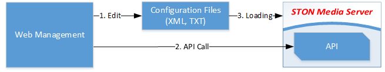
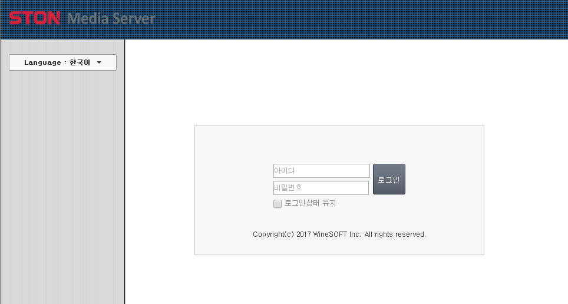
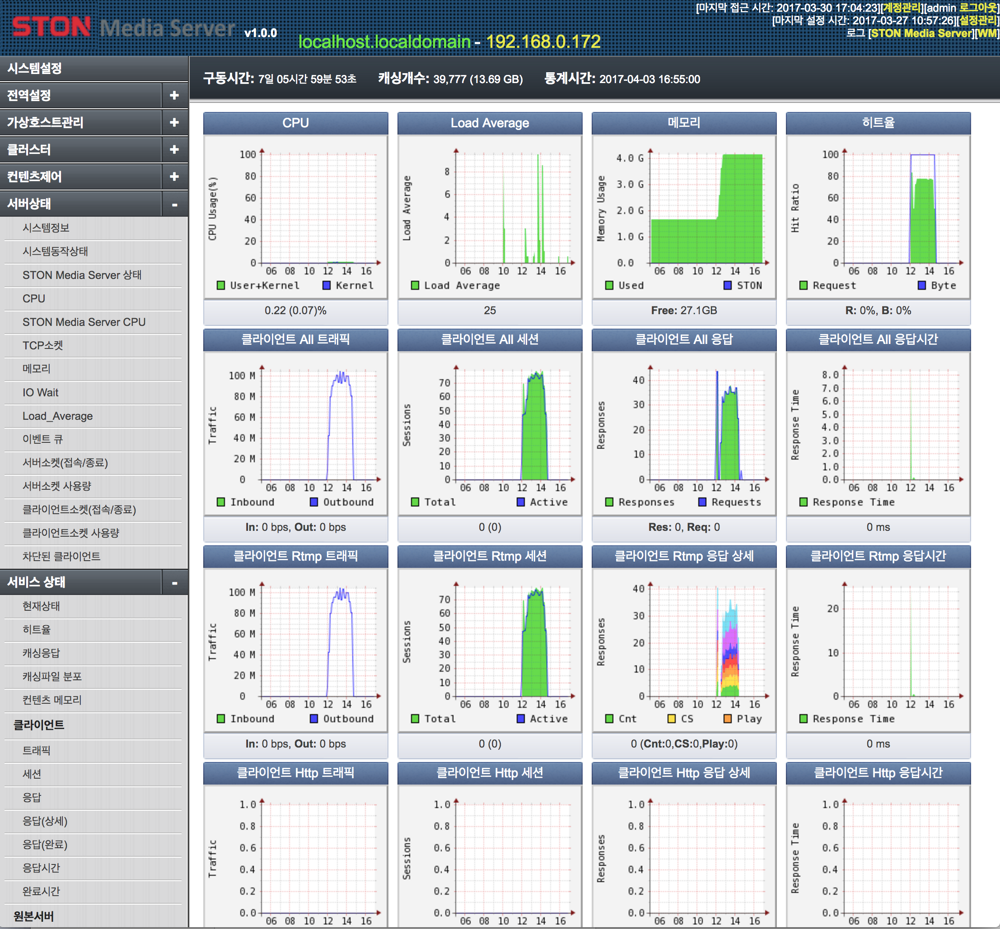

.. _wm:

12장. WM (Web Management)
******************

이 장에서는 Web Management(이하 WM)를 소개한다.
WM은 Web Interface로 동작하는 STON 미디어 서버 관리 도구이다.
사용자는 WM을 통하여 직관적으로 서비스를 구성할 수 있을 뿐만 아니라 클러스터를 구성하여 많은 수의 STON 미디어 서버를 통합관리 할 수 있다.

STON 미디어 서버를 설치하면 /usr/local/ston/wm 경로에 WM이 설치된다.
WM은 Apache 2.2.24 + PHP 5.3.24으로 구현되었다.
Apache를 사용하므로 /usr/local/ston/wm/conf/httpd.conf 파일을 편집하여 원하는 구성(예를 들어 HTTPS)으로 변경이 가능하다.

하지만 WM과 STON 미디어 서버는 느슨하게 결합되어 있다.
다음 그림처럼 WM은 STON 미디어 서버의 설정파일과 API만을 사용하여 STON 미디어 서버의 동작을 구성한다.

   WM은 STON 미디어 서버의 설정파일과 API를 사용한다.

우리는 이와 유사한 방식으로 WM을 능가하는 더 나은 관리기법이 존재할 것이라 생각한다.

.. toctree::
   :maxdepth: 2

접속
====================================

WM은 9500번 포트를 사용한다. 설치된 STON 미디어 서버의 IP가 192.168.0.100이라면
WM접근 주소는 http://192.168.0.100:9500이 된다.
앞서 언급한 대로 httpd.conf 파일을 변경하면 다른 포트로 변경할 수 있다.

   WM 접속초기화면

계정
====================================

기본 계정은 [아이디: **admin** , 비밀번호: **ston** ] 이다.
로그인에 성공하면 STON 미디어 서버의 전반적인 상태를 확인할 수 있는 대쉬보드 페이지가 나타난다.

   WM 대쉬보드

.. _wm-update:

최신버전 업데이트
====================================

최신버전이 릴리스되면 다음과 같이 "새로운 업데이트가 있습니다" 메시지가 표시된다.

   새로운 업데이트가 있습니다.

메시지를 클릭하시면 최신버전으로 업데이트할 수 있는 페이지가 표시된다.
현재 서비스 상태에 따라 업데이트 안전도 여부가 표시된다.
